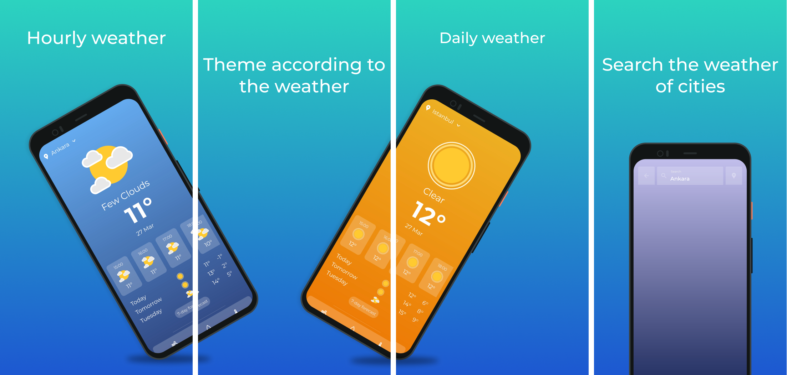

# Flutter Weather App

This repository contains an app that was developed to understand the Flutter.


## Deployment

Replace YOUR_API_KEY in the lib/services/weather.dart file with your Openweathermap API key.

```bash
  const apiKey = 'YOUR_API_KEY';
```


## Screenshots



## Link

[Google Play](https://play.google.com/store/apps/details?id=com.gdagtekin.weather)

## License

[MIT](https://choosealicense.com/licenses/mit/)

